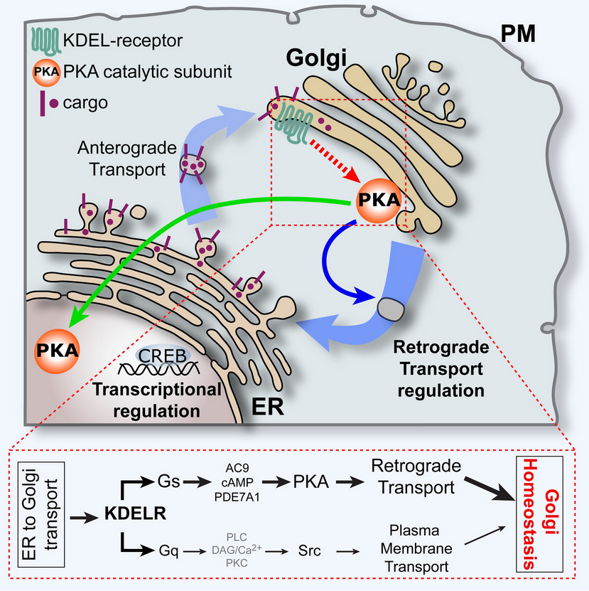
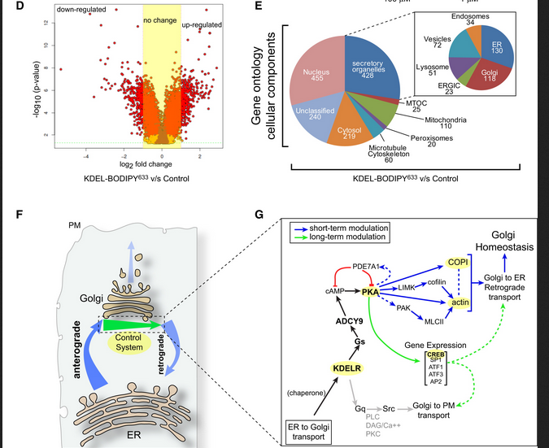
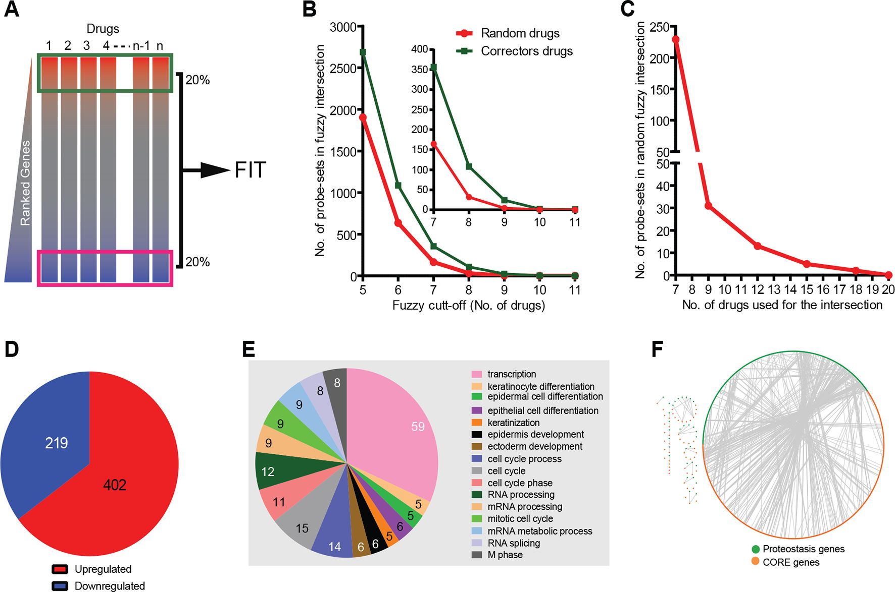
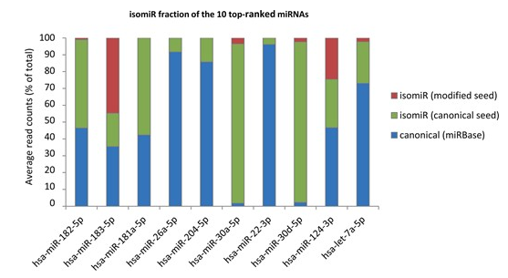
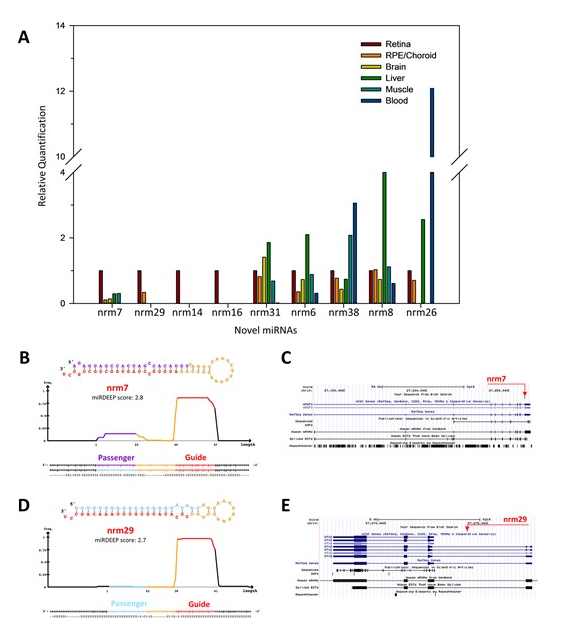
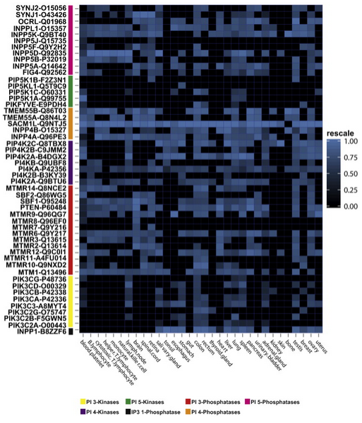
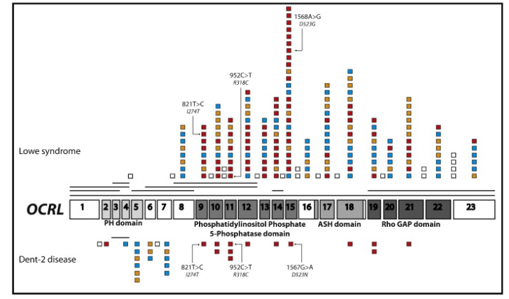

# CNR_and_TIGEM_Naples

## Collaboration with professor Alberto Luini
I have joined the Alberto Luini's lab. in 2012 and I felt immediately very comfortable with all the members of his group and ready to get the `interdisciplinary mindset`: that was a kind of challenge because I was the only bioinformatician inside the group and, at that time, people were not so used to interact with a person like me who decided (in 1999) to take a completely different professional path: going towards data analysis and computational system biology. The Luni's group is worlwide known for the expertise in understanding the Golgi apparatus other `secretory stations`, signaling hubs that receives, emits and elaborates signals.

As stated in Author Contributions part of this paper,[KDELR-Golgi](https://hdl.handle.net/11591/463043), I performed the bioinformatic analysis for a microarrays based experiment where a `wild type condition` was compared with a `KDEL-BODIPY condition`
This is the figure representing the most important results for the bioinformatic part, where ANOVA was performed, and the genes with an assigned ratio up to 1.5 and below −1.5 were used to select upregulated and downregulated genes, respectively.

During the same years (2012,2013,2014), I also had the opportunity to join an `extended team` including people from Bero's team working on deciphering the drug mode of action for promising drugs applied to interventions in patients suffering from cystic fibrosis. 

The results of our joined efferts has been published here:[F508del_CFTR_proteostasis](https://elifesciences.org/articles/10365)

## Collaboration with Dr. Giovanni D'Angelo

Giovanni D'Angelo (now at EPFL) is a brilliant researcher with a genuine interest in computational biology. He asked me to develop a pipeline aimed at identifying new putative transcription factor binding sites on promoter regions of `in house` previously characterized genes as differentially expressed genes dataset. Unfortunaltely this analysis has not been finalised in a manuscript because he decided to continue to develop another branch of the results.

## Collaboration with Dr. Claudia Angelini
I met Claudia initially as my neighbour in an adjacent building; she was working at the IAC Institute, which was connected to the original TIGEM Institute. At that time, I got immediately used to discussing with her the difficulties of finding a common language in a highly diverse and interdisciplinary group. We have always been in touch during these years, and I admire her intellectual honesty, scientific interests and willingness to help and contribute with a sincere and essential opinion on any relevant scientific aspects. 

## Collaboration with professor Sandro Banfi

I have joined the Sandro Banfi's lab. in 2014 and I felt immediately very comfortable with all the members of his group although I was, again, the only bioinformatician inside the group. 
Sandro hired me to analyse sample data derived mainly from the eye bulbs of sixteen cornea donors, in collaboration with the Eye Bank of Venice.
I conducted the analysis of small RNA-seq datasets and developed the computational pipeline that led to the discovery of previously uncharacterized miRNAs (canonical and isomiRs) involved in human retinal development.
[miRNomeNARjournal2016](https://academic.oup.com/nar/article-abstract/44/4/1525/1854878)
This project combined rigorous data processing and differential expression analysis, using miRDeep2 prediction algorithm to identify novel miRNAs and finally the functional interpretation together with experimental collaborators.

The results of this great publication are still accessible here: [miRetina database at TIGEM ](https://miretina.tigem.it/)
and here: [miRetina database 2](https://hdl.handle.net/11591/463043).

The results have been presented at the ARVO Annual Meeting, held in Seattle, Wash., May 1-5, 2016.
[miRNome2016](https://iovs.arvojournals.org/article.aspx?articleid=2560787).

## Collaboration with professor A. De Matteis

In this work: [GeneticDiseasesPhosphoinositides](https://www.sciencedirect.com/science/article/pii/S1388198114002534), we analyzed protein-expression data across human tissues to cluster functionally related phosphoinositide-metabolizing enzymes, many of which are mutated in inherited disorders.

 We showed that mutations in ubiquitously expressed PI enzymes can result in tissue-specific phenotypes. Although generally ubiquitously expressed, mutations in PI enzymes, which are predominantly loss-of-function, result in tissue-restricted clinical manifestations through mechanisms that are not yet fully understood. We demonstrated that mutations in PI3K and PTEN are associated with both inherited overgrowth syndromes and cancer. This type of genotype–phenotype mapping, pathway-level understanding and tissue specificity information inclusion is directly applicable to rare disease research, as illustrated here for some kidney disorders:

