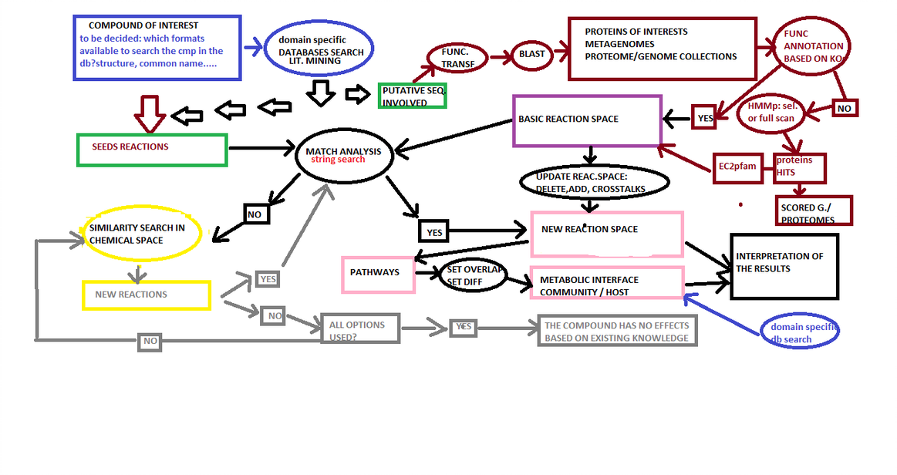

# Research Centre for Toxic Compounds in the Environment (RECETOX) at Masaryk University, Brno.

I have spent seven extraordinary years (from 2018 to 2024) in this laboratory, led by Dr. Eva Budinská: [IB2](https://bioinfo-recetox.github.io/people/)

The description of the scientific projects I was involved in and the further developments of some of them follow.

## The computational method `Deconvolution`

From metagenomic samples collected in a cohort study, the method derives a set of *metabolic potential embeddings* that represent the individual-specific metabolic capabilities of each person’s gut microbial community. The *metabolic potential embeddings* are the prerequisites for the method and the workflow to derive them is documented in my not yet public github repository here:[msmp](https://github.com/persicomaria/deconvolve_msmp/).

Once the prerequisites are met, the method *reverse-engineers* the bacterial abundance changes required in a given patient to match a reference individual’s metabolic potential, using a bacteria-to-metabolite association matrix. Conceptually, this constitutes a constrained optimization—or inverse problem—in systems biology.

Beyond guiding potential microbiome-targeted interventions, the method can also be used analytically to simulate transitions between metabolic states—such as modeling how microbial abundance changes might transform a healthy profile into a disease-associated one or vice versa. The method enables exploration of microbiome configurations that could reproduce a target metabolic potential, in either direction between healthy and diseased states.
The project is documented in my not yet public github repositories here:
[full](https://github.com/persicomaria/microbiomeDeconvolution/).

[dcvltn](https://github.com/persicomaria/deconvolve_FULLvignette/).

### Updated Perspective and further developments
#### The scenario named `Bioreactor`

## The MICROCHEM proposal

During the year 2018 I had the opportunity to write a IF Marie Curie proposal; it has not been selected but it gave me the chance to explore very interesting emerging research areas like the Chemoinformatics and the methodologies related to the study of promiscuos enzymes. 

[MICROCHEM](https://gitlab.ics.muni.cz/241325/MICROCHEM/)

### Updated Perspective and further developments
Designing metagenomic studies in highly polluted areas raises clear ethical concerns, as it would be inappropriate to experimentally test dose-dependent pollutant exposure and its effects on human gut microbiota. Maybe this was one of the weak points of my Marie Curie proposal. Therefore, computational modeling provides an ethically sound and scientifically robust alternative to investigate these interactions.

Recent methods enable the inference of the metabolic potential of microbial communities and the prediction of enzymatic promiscuity within their functional repertoires. Integrating these approaches allows us to expand the known reaction space of microbial consortia and simulate their adaptive responses under pollutant stress.

The core idea of a revised version of my original proposal is to use computational simulations, supported by existing soil microbiome data on pollutant degradation and biotransformation, to develop transferable models that can predict how xenobiotic exposure might reshape the human gut microbiome’s metabolic balance.

As a proof of concept I would start with the herbicide glyphosate. I would focus my efforts on collecting data about bacteria isolated from contaminated soil. Here some recent publications claiming the identification of bacterial (at the taxonomical resolution of strains) able to bio transform the glyphosate:

#### Table

| Original Publication Identifier (DOI/PMID/PMCID)  |  Bacterial Strain |
| ---- | ------ |
| DOI: 10.3390/microorganisms13030651    | Caballeronia zhejiangensis CEIB S4-3    |
|DOI: 10.1016/S1002-0160(17)60381-3   | Comamonas odontotermitis P2  |
| DOI: 10.1007/s11356-024-33772-2    |  Burkholderia cenocepacia CEIB S5-2   |
| DOI: 10.1016/j.jhazmat.2022.128689   | Chryseobacterium sp. Y16C    |
| DOI: 10.1007/s00203-017-1343-8   | Ochrobactrum anthropi GPK 3|

## The Estimated Metabolome

This project has been built upon the work of Larsen et al[Larsen_oriPRMT](https://www.ncbi.nlm.nih.gov/pubmed/25072414) and 
Noecker et all[Noecker](https://pmc.ncbi.nlm.nih.gov/articles/PMC8896604/). Part of the code is still used by some people at Recetox.

[estimatedMetabolome](https://gitlab.ics.muni.cz/241325/estimatedMETABOLOME)

## Supervision of Bachelor and Master Thesis (Computational biology and biomedicine program study at Masaryk University)
Maria Persico, PhD
učo 241325
Compiled on: 19/5/2025 10:33.43, https://is.muni.cz/auth/management/vypis_pedag_cinnost, version: 1.5
Processed for the period from 1/9/2017 to 1/8/2025.
Lectures
PřF:Bi4013 Team project of Computational Biology and Biomedicine - Biomedical Bioinform• Spring 2022
– number of lecturers: 5 (D. Bednář, E. Budinská, N. Martínková, M. Persico, V. Popovici)
– length: 0/2, 2 credit(s) (plus extra credits for completion)
– enrolled/evaluated students: 9/9
• Spring 2021
– number of lecturers: 5 (D. Bednář, E. Budinská, N. Martínková, M. Persico, V. Popovici)
– length: 0/2, 2 credit(s) (plus extra credits for completion)
– enrolled/evaluated students: 17/17
PřF:E1051 Introduction to Computational Biology and Biomedicine II
• Spring 2025
– number of lecturers: 8 (D. Bednář, E. Budinská, L. Dušek, J. Jarkovský, N. Martínková, T. Pavlík, M. Persico,
V. Popovici)
– length: 1/0, 1 credit(s)
– enrolled/evaluated students: 38/0
• Spring 2024
– number of lecturers: 8 (D. Bednář, E. Budinská, L. Dušek, J. Jarkovský, N. Martínková, T. Pavlík, M. Persico,
V. Popovici)
– length: 1/0, 1 credit(s)
– enrolled/evaluated students: 23/20
• Spring 2023
– number of lecturers: 8 (D. Bednář, E. Budinská, L. Dušek, J. Jarkovský, N. Martínková, T. Pavlík, M. Persico,
V. Popovici)
– length: 1/0, 1 credit(s)
– enrolled/evaluated students: 34/29
Vedení seminářů
No match has been found.
Supervision of bachelor's theses
1. Hodnocení dostupných pipeline pro funkční anotaci mikroorganismů s předpokládanými probiotickými
vlastnostmi.
Student: Bc. Lucia Koštialová, učo 505841, PřF B-MBB BIOMB, defended: 21/6/2023
Supervision of (follow-up) master's theses
Student: Md. Kateřina Šumberová 520884
- Přírodovědecká fakulta

### Updated Perspective and further developments
The rapid expansion of microbiome research across health and environmental domains is generating billions of new microbial sequences that require functional characterization. To address this challenge, I am developing the idea of a distributed, citizen-science–driven computational framework in which trained participants collaborate to annotate emerging metagenomic datasets.

I am working on the possibility to start a pilot project involving a small group of students-annotators of classes "Bi4013 Team project of Computational Biology and Biomedicine" and "E1051 Introduction to Computational Biology and Biomedicine II" (Computational biology and biomedicine,Masaryk University). If the students will choose this project-topic for their thesis, I will be consultant for this pilot project. Another promising direction is to get in contact with the iGEM community of Brno
. Although this community is more `biotechnology oriented`, the engagement with cutting-edge computational biology experiments might be of interest for someone.

Through guided training, participants—“citizens of science”—might learn how to build or operate AI-based agents capable of transforming catalogs of bacteria derived from metagenomic samples into high-dimensional embeddings that capture the functional potential of the corresponding microbial communities. This collaborative platform aims to combine community engagement with cutting-edge computational biology, accelerating large-scale functional annotation while fostering scientific literacy.

## Collaborations with other PI at RECETOX

-Cooperation with professor Ondrej Adamovsky, PI in Mechanistic Toxicology at the Research Centre for Toxic Compounds in the Environment (RECETOX)

As a part of this collaboration, a full bioinformatic pipeline has been developed that helped Ondrej and his international collaborators to understand complex multi-layer data, specifically data from transcriptomics and metagenomics. From a biological perspective the results of the computational approache enabled testable hypotesis generation about the impact of
deregulated microbial metabolites on host immunity.
The data analysis strategy was considered innovative enough to be acknowledged by publication in the Environmental Science and Technology journal (TOP 7% journal in environmental sciences).

Recently, the code documented in my gitlab reposity here: [estimatedMetabolome](https://gitlab.ics.muni.cz/241325/)
has been applied by Ondrej and other collaborators in this other publication: [Antimicrobials Shape](https://pubs.acs.org/doi/10.1021/acs.est.5c04159)

## MicrobiomeAnalysis

### Microbiome Datasets Are Compositional: And This Is Not Optional

"Microbiome datasets Are Compositional: And This Is Not Optional" is the title of a publication by the author G.Gloor.

- In House datasets analysis

  - my original literature selection about this topic
  - my contribution to this topic

#### Example Workflows

- in House Dataset FYOL
