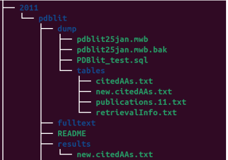
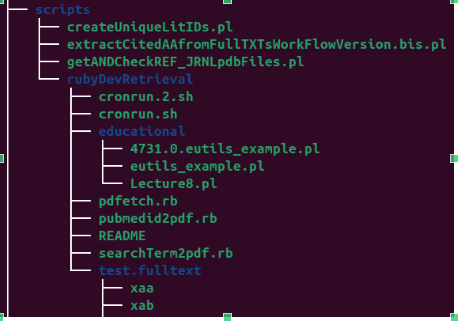
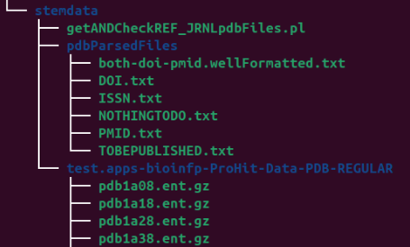

# Dresden

## As Service and as researcher

### PDBlit project
The PDBlit project was about building a literature mining workflow aimed at automatic extraction of relevat information from 
a very narrow domain of Bioinformatics, precisely the Structural Bioinformatics.
I have organized the results in a small database and this is the screeshot for the `dump` of the project:

This is the screeshot for the required code (partial output of tree command)

This is the screeshot for some test data (partial output of tree command)

### The ACM conference

#### Conference paper the collaboration with professor Maria Rizzo

